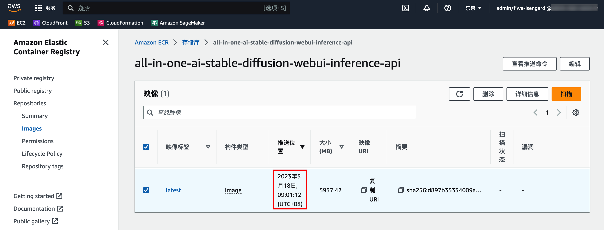

# API 本地调试
## 方法一(纯本地调试,不推荐)
1. fork https://github.com/xieyongliang/stable-diffusion-webui 和 https://github.com/xieyongliang/stable-diffusion-webui-api,注意要fork 所有分支
2. 起一台带GPU的实例,如G4dn.2xlarge,或G5.2xlarge将以上代码下载到本地.
3. 修改需要的代码
  - 入参定义位于modules/api/models.py 的 *class InvocationsRequest(BaseModel)*
  - 调用后处理位于modules/api/api.py *post_invocations*
4. stable-diffusion-webui-api 目录中执行docker build -t stable-diffusion-webui-inference-api -f Dockerfile.inference . 
5. docker build 完成后,通过docker images 应该可以看到有 all-in-one-ai-stable-diffusion-webui镜像
6. 执行docker run -it --entrypoint bash --gpus all stable-diffusion-webui-inference-api
7. 为避免出现访问S3问题,执行apt install awscli -y,安装awscli,并执行aws configure 配置本地访问权限(需要提前准备S3访问权限的密钥)
8. 进入docker shell 以后执行python3 serve & 即可开启容器内本地调试环境,访问地址http://localhost:8080
## 方法二(配合ECR和API Gateway+Lambda)
1. fork https://github.com/xieyongliang/stable-diffusion-webui 和 https://github.com/xieyongliang/stable-diffusion-webui-api,注意要fork 所有分支(不要勾选only main)
2. 使用前期部署API的实例,参考API版本的[部署文档](https://github.com/brilliantwf/mydemo/blob/main/Allin1AI/%E9%83%A8%E7%BD%B2%E6%89%8B%E5%86%8C/API%E7%89%88%E6%9C%AC/%E9%83%A8%E7%BD%B2%E6%96%87%E6%A1%A3.md).
3. 上述代码下载到上述实例.
4. 在stable-diffusion-webui repo中修改需要的代码
  - 入参定义位于modules/api/models.py 的 *class InvocationsRequest(BaseModel)*
  - 调用后处理位于modules/api/api.py *post_invocations*
5. 修改后记得push到自己的git repo中
6. 修改本地位于stable-diffusion-webui-api/ 的Dockerfile.inference 文件,将其中的clone地址修改为自己的repo地址 如:


```sh
...
ADD https://api.github.com/repos/xieyongliang/stable-diffusion-webui/git/refs/heads/api webui.version.json
RUN git clone https://github.com/{YOURAccount}/stable-diffusion-webui.git /opt/ml/code -b api
...
```
7. 进入stable-diffusion-webui-api/ 目录,执行 ./build_and_push.sh  $REGION (注意之前的REGION环境变量是否还在)
8. build push 完成后,在ECR 的[存储库](https://ap-northeast-1.console.aws.amazon.com/ecr/repositories?region=ap-northeast-1)中可以看到更新后的image,推送日期即最新的日期(可以考虑把旧版本删除)

9. 此时再去访问原有的API GW地址返回 的就是修改后代码的返回.

