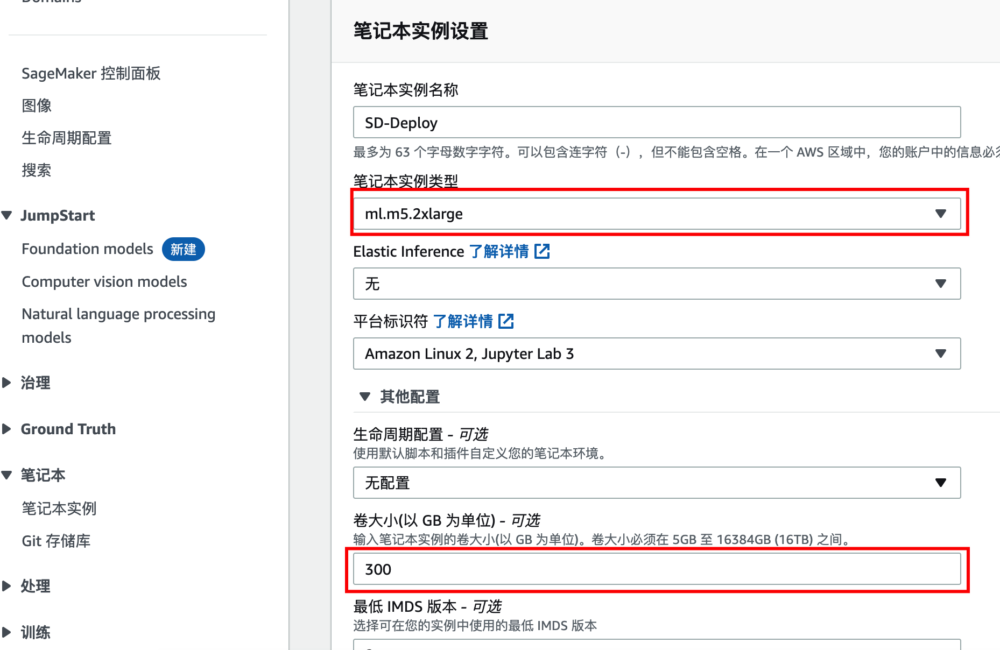
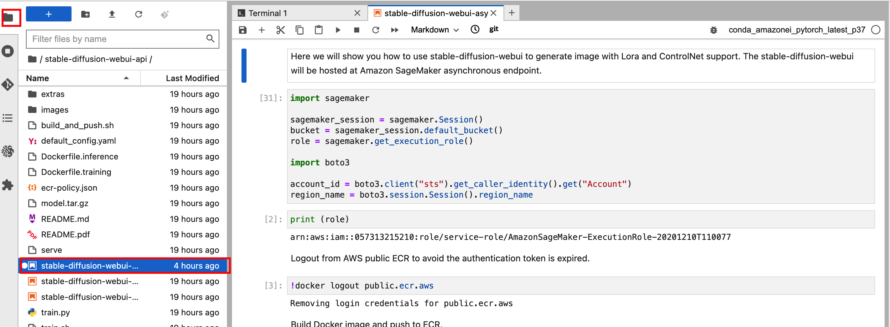
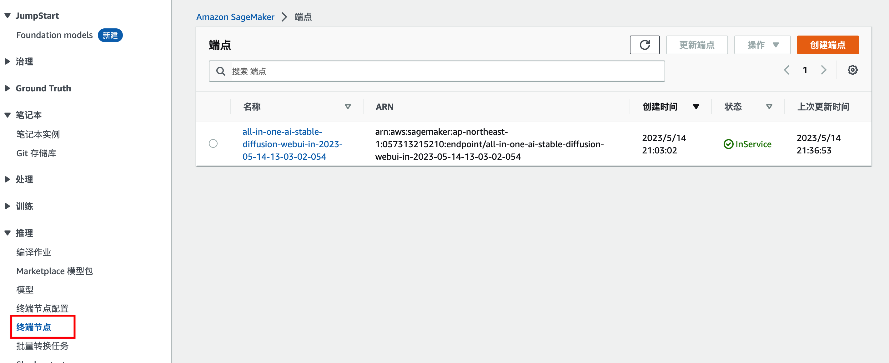
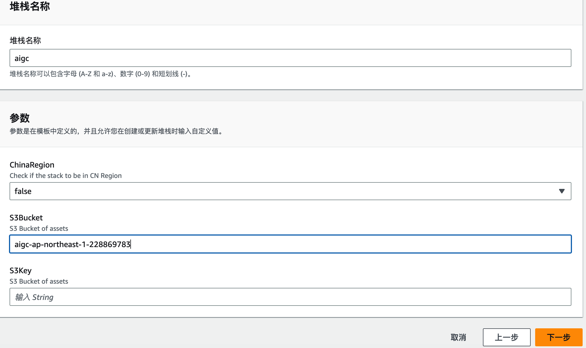
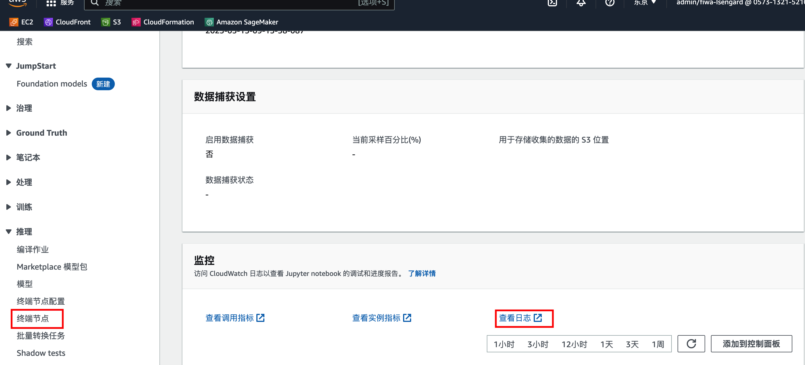
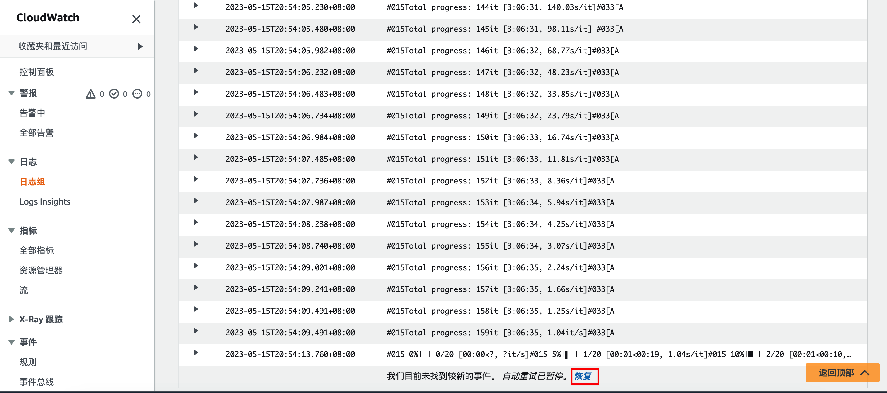

# API版本部署
## 1. 推理端点部署
1. 进入AWS 控制台,转入Sagemaker服务,找到**笔记本实例**-->**创建笔记本实例**


2. 在创建笔记本实例界面输入笔记本实例名称,将卷大小配置修改为300GB



在下方IAM角色选择中选择前期创建的实例角色,改角色需要有 AmazonS3FullAccess 和 AmazonEC2ContainerRegistryFullAccess两个权限.
其余保持默认,点击**创建笔记本实例**即可

3. 稍等片刻待创建完成,状态变成**InService**,点击**打开JupyterLab**


4. 在Notebook界面中,点击左上方File-->New-->Terminal


5. 在新打开的终端界面,进入Sagemaker目录,下载代码

```sh
sh-4.2$ cd SageMaker/
sh-4.2$ git clone https://github.com/xieyongliang/stable-diffusion-webui-api.git
```
在代码拉取完成后,点击左边文件夹图标,进入stable-diffusion-webui-api/ 文件夹,双击stable-diffusion-webui-async-inference.ipynb



6. 后续按照notebook中顺序执行即可(注意,需要等待上一步完全执行完毕,再执行下一步,如步骤处有*则表示仍在运行.)


7. 注意:最后的清理步骤不要运行,否则之前部署的端点资源会被删除


8. notebook执行完毕后,可以在Sagemaker服务下推理的**终端节点**处找到已经部署的终端节点



记录这个端点的名称,后续会使用

## 2. API 网关部署

1. 在同一个区域启动一台EC2,系统使用ubuntu 22.04版本以上,存储空间200G即可,需要挂载前期创建的的角色(AmazonS3FullAccess 和 AmazonEC2ContainerRegistryFullAccess权限)


2. 在系统内安装必要的安装包

```sh
sudo apt install -y awscli python3-pip zip jq
```

3. 在系统内执行以下命令开始部署
```sh
#使用root权限
sudo -s
#启用Screen避免意外终止,如断开可以用screen -rd sessionid 恢复
screen -R aigc-demo

#设置所在的区域
export REGION=ap-northeast-1
#获取当前账号ID
export YOUR_ACCOUNT_ID=`aws sts get-caller-identity --query 'Account' | tr -d '"'`
#创建一个S3桶用于存放相关代码
export AIGC_BUCKET_NAME="aigc-${REGION}-`date +'%N'`"
aws --region $REGION s3 mb s3://$AIGC_BUCKET_NAME

#获取相关代码(需要授权)
git clone https://github.com/xieyongliang/stable-diffusion-webui-api
cd stable-diffusion-webui-api/extras/deployment/
docker logout public.ecr.aws
#开始部署代码
./build_and_deploy.sh s3://$AIGC_BUCKET_NAME $REGION
#待创建完成后,获取Cloudformation 的路径
echo 
aws s3 presign s3://$AIGC_BUCKET_NAME/templates/all-in-one-ai-lambda.yaml | cut -d '?' -f 1
记录以输出的地址
```

4. 在cloudformation中部署API gateway和Lambda
- 进入cloudformation服务,点击**创建堆栈**,在Amazon S3 URL中输入第三步中的地址
- 点击下一步
- 在堆栈详细信息中输入名称和相关参数,注意,在S3bucket中只需要输入通名称

- 点击下一步等待部署完成
- 等待创建完成CREATE_COMPLETE,记录输出中的ApiGatewayProdEndpoint

## 3. API测试验证

1. 生成测试payload

```sh
tee lora.json << END
{
    "task": "text-to-image",
    "model": "v1-5-pruned.ckpt",
    "txt2img_payload": {
        "enable_hr": false,
        "denoising_strength": 0,
        "firstphase_width": 0,
        "firstphase_height": 0,
        "hr_scale": 2,
        "hr_upscaler": "",
        "hr_second_pass_steps": 0,
        "hr_resize_x": 0,
        "hr_resize_y": 0,
        "prompt": "(yorha no. 2 type b), 1girl, blue eyes, white hair, no blindfold, baseball cap, simple background, red shirt, upper body, (masterpiece), short hair, mole under mouth, nier automata, parted lips, <lora:yorha_noDOT_2_type_b:0.5>",
        "styles": [""],
        "seed": 2045180904,
        "subseed": -1,
        "subseed_strength": 0,
        "seed_resize_from_h": -1,
        "seed_resize_from_w": -1,
        "sampler_name": "",
        "batch_size": 1,
        "n_iter": 1,
        "steps": 20,
        "cfg_scale": 9,
        "width": 512,
        "height": 512,
        "restore_faces": false,
        "tiling": false,
        "do_not_save_samples": false,
        "do_not_save_grid": false,
        "negative_prompt": "skirt, (painting by bad-artist-anime:0.9), (painting by bad-artist:0.9), watermark, text, error, blurry, jpeg artifacts, cropped, worst quality, low quality, normal quality, jpeg artifacts, signature, watermark, username, artist name, (worst quality, low quality:1.4), bad anatomy",
        "eta": 0,
        "s_churn": 0,
        "s_tmax": 0,
        "s_tmin": 0,
        "s_noise": 1,
        "override_settings": {},
        "override_settings_restore_afterwards": true,
        "script_args": [],
        "sampler_index": "DPM++ SDE Karras",
        "script_name": "",
        "send_images": true,
        "save_images": false,
        "alwayson_scripts": {}
    }
}
END
```

2. 使用curl调用 API验证.

curl -X POST -H 'Content-Type: application/json' "https://API网关地址/inference?endpoint_name=推理端点地址" --data '@./lora.json'
如:
curl -X POST -H 'Content-Type: application/json' "https://8pwm7nzn9e.execute-api.ap-northeast-1.amazonaws.com/Prod/inference?endpoint_name=all-in-one-ai-stable-diffusion-webui-in-2023-05-15-09-15-58-08" --data '@./lora.json'

## 4. 增加模型
在Sagemaker 上有三种部署部署的方式分别是

1. 打包所有模型到models.tar.gz并部署到推理节点
2. 将模型下载并存放到S3通指定位置(此方法为动态加载),s3://sagemaker-{region_name}-
{account_id}/stable-diffusion-webui/models/可选,需要将特定模型文件存放到对应文件夹
- Stable-diffusion/
- ControlNet/
- Lora/
3. 配置环境变量,并在启动时加载默认模型.
在 notebook [6]cell中可以定义需要使用到的模型,注意huggingface是基于repo_id加载,如果原有代码中没有你需要使用到的模型,可以自行按格式修改即可.
修改完成后,需要重新部署端点,即运行 cell [20],[21],[9],[10]

## 5. 错误监控
可以使用Amazon Cloudwatch 来监控推理端点的运行情况

进入Amazon Sagemaker -->推理-->终端节点,点击之前部署的终端节点,在下方监控处找到查看日志.



在日志流选项卡中找到最新的日志流并点击.



在最下方点击**恢复**,即可自动重试查找最新的日志.

## 6. 推理payload参考
1. 使用Lora 

```json
{
    "task": "text-to-image",
    "model": "v1-5-pruned.ckpt",
    "txt2img_payload": {
        "enable_hr": false,
        "denoising_strength": 0,
        "firstphase_width": 0,
        "firstphase_height": 0,
        "hr_scale": 2,
        "hr_upscaler": "",
        "hr_second_pass_steps": 0,
        "hr_resize_x": 0,
        "hr_resize_y": 0,
        "prompt": "yorha no. 2 type b, 1girl, bangs, black blindfold, black dress, black gloves, black hairband, blindfold, blindfold removed, breasts, cleavage cutout, clothing cutout, commentary request, dress, gloves, hairband, half-closed eyes, hand up, highres, io (sinking=carousel), juliet sleeves, long sleeves, looking at viewer, medium breasts, mole, mole under mouth, nier (series), nier automata, no blindfold, parted lips, puffy sleeves, short hair, solo, thighhighs, turtleneck, upper body, white hair, bokeh <lora:2bNierAutomataLora_v2b:0.5>",
        "styles": [""],
        "seed": 2674865251,
        "subseed": -1,
        "subseed_strength": 0,
        "seed_resize_from_h": -1,
        "seed_resize_from_w": -1,
        "sampler_name": "",
        "batch_size": 1,
        "n_iter": 1,
        "steps": 20,
        "cfg_scale": 7,
        "width": 512,
        "height": 512,
        "restore_faces": false,
        "tiling": false,
        "do_not_save_samples": false,
        "do_not_save_grid": false,
        "negative_prompt": "(worst quality, low quality:1.3)",
        "eta": 0,
        "s_churn": 0,
        "s_tmax": 0,
        "s_tmin": 0,
        "s_noise": 1,
        "override_settings": {},
        "override_settings_restore_afterwards": true,
        "script_args": [],
        "sampler_index": "DPM++ SDE Karras",
        "script_name": "",
        "send_images": true,
        "save_images": false,
        "alwayson_scripts": {},
    },
}
```
2. 使用controlnet

```json
{
    "task": "text-to-image",
    "model": "v1-5-pruned.ckpt",
    "txt2img_payload": {
        "enable_hr": false,
        "denoising_strength": 0,
        "firstphase_width": 0,
        "firstphase_height": 0,
        "hr_scale": 2,
        "hr_upscaler": "",
        "hr_second_pass_steps": 0,
        "hr_resize_x": 0,
        "hr_resize_y": 0,
        "prompt": "ballon",
        "styles": [""],
        "seed": -1,
        "subseed": -1,
        "subseed_strength": 0,
        "seed_resize_from_h": -1,
        "seed_resize_from_w": -1,
        "sampler_name": "",
        "batch_size": 1,
        "n_iter": 1,
        "steps": 20,
        "cfg_scale": 7,
        "width": 512,
        "height": 512,
        "restore_faces": false,
        "tiling": false,
        "do_not_save_samples": false,
        "do_not_save_grid": false,
        "negative_prompt": "",
        "eta": 0,
        "s_churn": 0,
        "s_tmax": 0,
        "s_tmin": 0,
        "s_noise": 1,
        "override_settings": {},
        "override_settings_restore_afterwards": true,
        "script_args": [],
        "sampler_index": "DPM++ SDE Karras",
        "script_name": "",
        "send_images": true,
        "save_images": false,
        "alwayson_scripts": {
            "controlnet": {
                "args": [
                    {
                        "enabled": true,
                        "module": "none",
                        "model": "control_sd15_canny [fef5e48e]",
                        "weight": 1,
                        "image": encode_image_to_base64(image),
                        "low_vram": false,
                        "processor_res": 64,
                        "threshold_a": 64,
                        "threshold_b": 64,
                        "guidance_start": 0,
                        "guidance_end": 1,
                        "guess_mode": false,
                    }
                ]
            }
        },
    },
}
```


