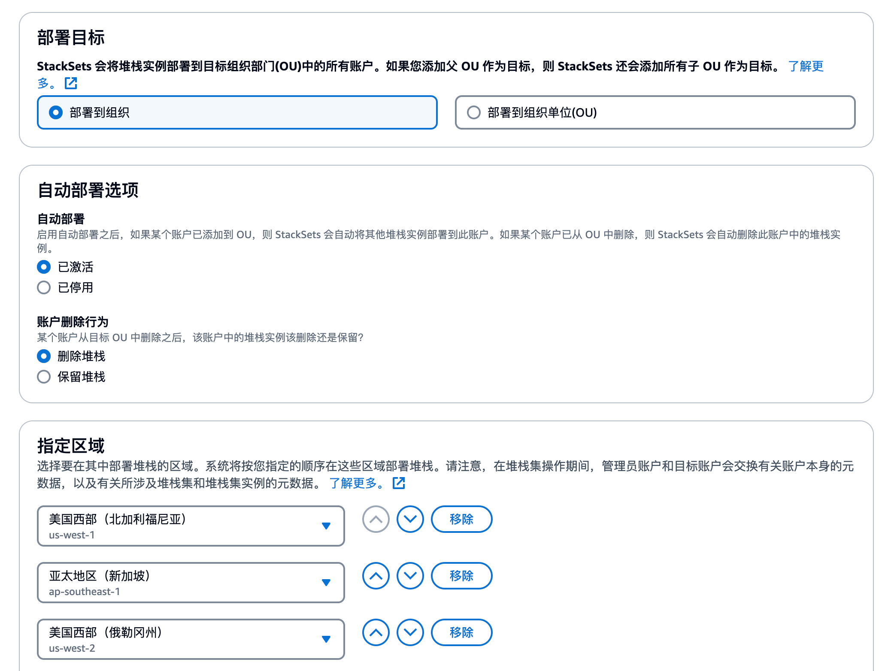

# AWS账号 安全事件集中告警
## 1. 方案背景
### 1.1 背景介绍
用户在首次使用 AWS 服务搭建业务架构,最需要关注的是AWS账号和平台内业务的安全性,通常来讲,用户最需要关注的是以下安全服务和其提供相关事件,包括:
1. CloudTrail: 账号下所有AWS服务的操作记录,包括API调用,CLI调用,SDK调用等,这里重点需要关注账号有没有异常登录,IAM内有没有新资源的创建和修改,例如角色/账号创建创建动作,EC2 的异常关停终止等.
2. Guardduty: 检测账号下所有AWS服务的潜在风险,并提供相应的安全事件,尤其对于安全等级>4(中高风险)事件应该引起足够重视
但是,一般用户在首次使用事,对于这些安全时间的查看并不及时,导致容易出现安全漏洞,或者安全事件被忽略.
鉴于此,此方案提供了一个快速部署账号集中安全事件监控和通知的方法,方便用户在首次使用 AWS 服务后快速部署一个多账号/区域集中告警通知的方案
### 1.2  方案介绍
此方案整体上使用了Cloudformation 模板,通过模板部署一个集中告警的Eventbridge 规则,该规则会收集其他账号下的安全事件并发送到账号中心,账号中心会根据账号中心配置的告警规则,将告警事件发送到账号中心配置的告警通道.
目前支持的告警事件包括:
1. 账号控制台登录
2. EC2 状态变更,停止,终止
3. IAM状态变更,"CreateUser", "CreateRole", "CreatePolicy", "CreatePolicyVersion", "AddUserToGroup", "AttachGroupPolicy", "AttachRolePolicy", "AttachUserPolicy", "PutGroupPolicy", "PutRolePolicy", "PutUserPolicy"
4. Guardduty 告警,级别>4 以上告警
### 1.3 方案架构

架构说明:
1. 用户在主账户的美东 1 区(由于 IAM 限制必须部署在此区域)通过 Cloudformation 部署一个中心Eventbridge 规则
2. 用户的其他账号根据需要,通过 Cloudformation 部署一个分支Eventbridge 规则,并将账号Eventbridge 规则的Target 指向中心Eventbridge 规则
3. 中心Eventbridge 规则会收集其他账号下的安全事件并发送到主,账号中心会根据账号中心配置的告警规则,将告警事件发送到账号中心配置的告警通道.

## 2. 方案部署
### 2.1 创建中心Eventbridge

**前置条件:账号需要先启用Cloudtrail**

1. 部署中心Eventbridge 规则
点击下面的链接在中心账号部署Eventbridge 规则(部署到美东1区)
https://us-east-1.console.aws.amazon.com/cloudformation/home?region=us-east-1#/stacks/quickcreate?stackName=centraeb&Region=us-east-1&templateURL=https://wh-tempdata.s3.amazonaws.com/eventbridge/centra_EB.yaml

在参数Amazon SNS parameters 中输入需要告警通知的邮箱地址,在 GuarddutyisEnable 中选择是否已经开启了 Guardduty(默认是不开启的),如果不确定是否开启,可以点击[Guardduty](https://us-east-1.console.aws.amazon.com/guardduty/home?region=us-east-1#/summary)查看对应区域的 Guardduty 是否已经开启.

创建完毕后记录下Cloudformation 输出中 Eventbridge的ARN,后面会用到

### 2.2 在分支账号创建Eventbridge 通知

#### 2.2.1 创建分支账号Eventbridge通知(非组织账号)

如果没有使用Organization服务,需要在每个需要通知的账号和区域部署.

点击如下链接在分支账号部署Eventbridge 规则(部署到美东1区),由于IAM和登录的状态变更检查需要在美东一区,因此需要在美东一区部署

https://us-east-1.console.aws.amazon.com/cloudformation/home?region=us-east-1#/stacks/quickcreate?stackName=brancheb&Region=us-east-1&templateURL=https://wh-tempdata.s3.amazonaws.com/eventbridge/Branch_EB.yaml

如果在其他区域使用资源,例如需要再新加坡区域部署则将上述链接中的Region修改为对应区域即可(或者直接切换区域)

https://us-east-1.console.aws.amazon.com/cloudformation/home?region=us-east-1#/stacks/quickcreate?stackName=brancheb&Region=ap-southeast-1&templateURL=https://wh-tempdata.s3.amazonaws.com/eventbridge/Branch_EB.yaml

在Amazon Eventbridge parameters参数中输入中心Eventbridge的ARN(之前Cloudformation 的输出中记录的ARN)

勾选**我确认,...** 后点击创建堆栈

#### 2.2.2 创建分支账号Eventbridge通知(使用组织账号)
使用Organization 服务可以加速分支账号的部署.登陆Organization的管理账号(或者Delegated CloudFormation Administrator),进入Cloudformation 的 StackSets 界面

点击创建 Stackset,在上传模板文件中选择Branch_EB.yaml文件

在参数中Amazon Eventbridge parameters填入中心Eventbridge的ARN(之前Cloudformation 的输出中记录的ARN)

在部署选项中选择部署到组织或者部署到组织单位(OU),在指定区域中选择需要部署的区域部署,其他选项根据实际情况选择.

点击下一步,审核各选项后,点击提交确认部署

## 3. 验证
部署完中心和分支Eventbridge后,如果中心或者分支账号已部署上述堆栈的区域出现了以下事件,会触发邮件告警,包括:
1. 账号控制台登录

3. IAM 出现了异常行为包括("CreateUser", "CreateRole", "CreatePolicy", "CreatePolicyVersion", "AddUserToGroup", "AttachGroupPolicy", "AttachRolePolicy", "AttachUserPolicy", "PutGroupPolicy", "PutRolePolicy", "PutUserPolicy")

5. EC2 的状态出现了变更(停止,终止)

7. Guardduty出现4级以上的异常告警(severity>4).

## 4. 定制和资源
 在Cloudformation 中定义了一些事件规则,例如monitoring IAM activity 规则中,eventName包含了: ["CreateUser", "CreateRole", "CreatePolicy", "CreatePolicyVersion", "AddUserToGroup", "AttachGroupPolicy", "AttachRolePolicy", "AttachUserPolicy", "PutGroupPolicy", "PutRolePolicy", "PutUserPolicy"],如果需要增加或减少,可以在eventName中添加或删除.
其他资源参考:
1. AWS Guardduty 介绍 https://aws.amazon.com/guardduty/
2. AWS Eventbridge 介绍 https://aws.amazon.com/eventbridge/
3. 多账号部署https://aws.amazon.com/blogs/security/deploy-aws-organizations-resources-by-using-cloudformation/
4. 通知到 Feishu 机器人,可以参考sns2fs.zip 代码.

