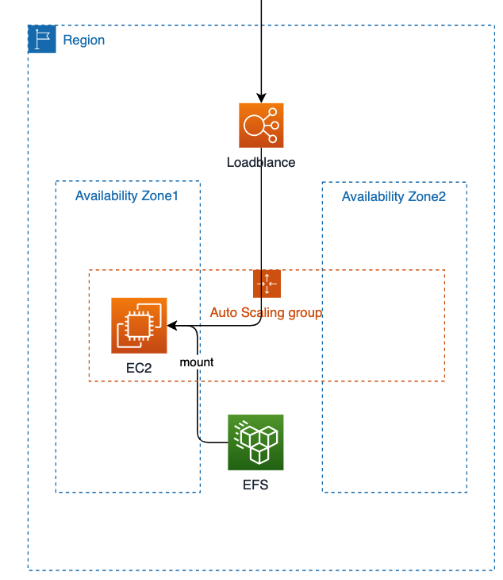
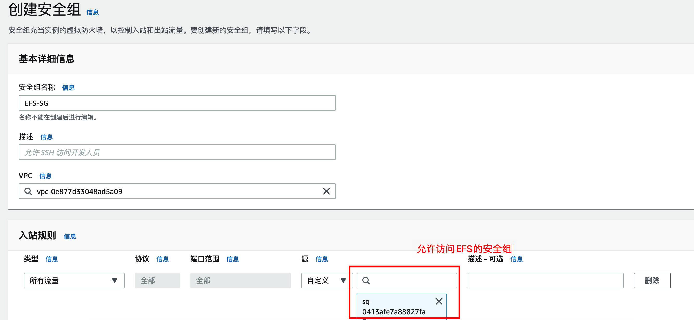
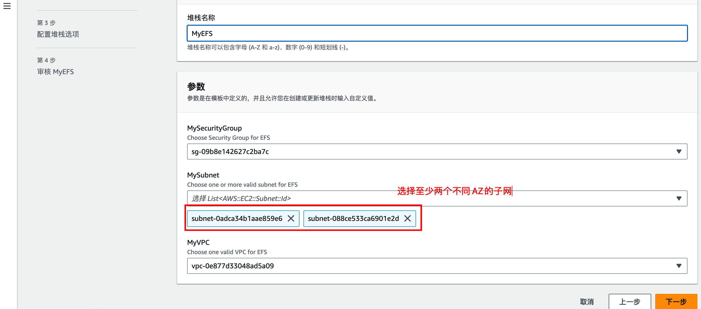
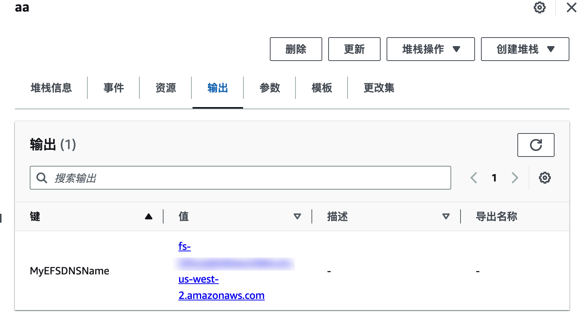
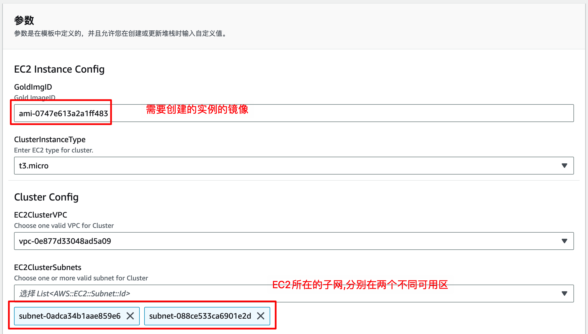
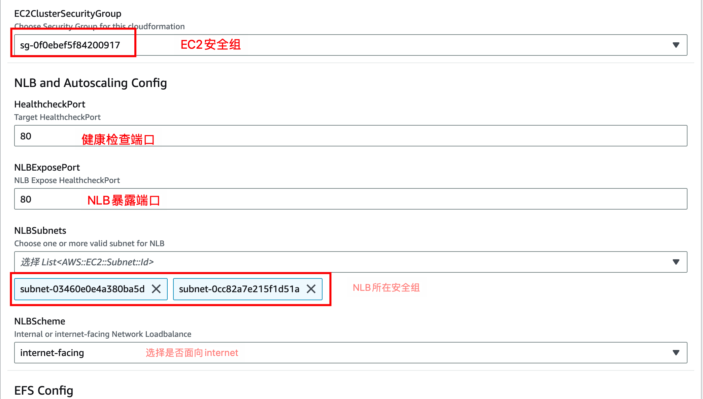

# 利用EFS 实现单AZ服务器的容灾

根据AWS 优良架构(well-architected framework)的建议,系统架构应该能满足自动恢复和分布式容灾的架构,因此我们强烈建议EC2的业务能做到分布式和无状态化,便于利用弹性和快速恢复.
但某些特殊情况只允许单台服务的情况下,可以利用以下架构实现单可用区的容灾.

## 1. 架构及原理


原理说明:

1. 主要利用Autoscaling group配合 健康检查实现实例数量的保持(保持为1)
2. 前端如果不是http服务,推荐使用NLB性能会更好
3. 所有数据持久化到[EFS](https://aws.amazon.com/cn/efs/)可以保证11个9的可靠性
4. 使用userdata自动挂载EFS文件系统,保证恢复的服务器数据一致.

## 部署过程.

1. 创建基本环境

- 创建VPC (过程略)
- 在VPC里创建分布在两个可用区子网,例如us-west-1a和us-west-1b(过程略)
- 创建相应的安全组,包括EFS,EC2 的安全组.
创建允许访问EFS的安全组,注意需要在指定的VPC中创建



1. EFS 创建过程

下载"创建EFS.yml",并使用cloudformation创建stack,具体配置参数参考如下:



创建完成后在输出中可以看到EFS的DNS地址.



3. EC2集群创建 

下载"单AZ实例.yml"并使用cloudformation创建stack,具体配置参数参考如下:





在EFS config中填入 前期创建的EFSDNS地址
如
fs-XXX.efs.region.amazonaws.com

注意以上配置需要根据实际情况修改,如果是非http端口,注意调整.

创建完成后,可以在输出中看到NLB的地址.

## 测试

部署完成后,我们可以正常访问NLB的地址.

此时如果终止原EC2,Autoscaling group为维持1台的容量,会再启动一台服务器.
注意,系统启动,健康状态检查到系统完成注册需要一段时间.但此时的文件持久化在EFS,不必担心数据丢失.

## cloudformation 代码问题

1. 如何修改实例的数量
   
该CFN可以方便的扩展为多可用区架构,只需要修改AutoScalingGroup, MinSize, MaxSize和DesiredCapacity即可,此脚本中是1台

2. 如何增加实例类型
   
修改ClusterInstanceType AllowedValues值即可

1. 如何实现的自动挂载EFS

如果自己手动恢复只需要在在userdata中增加以下代码即可,或者转换成AMI也可以.

```sh
    #!/bin/bash
    mkdir /mnt/efs
    echo "${EFSDNSName}:/ /mnt/efs nfs4 nfsvers=4.1,rsize=1048576,wsize=1048576,hard,timeo=600,retrans=2,noresvport,_netdev 0 0" >> /etc/fstab
    mount -a
```
其他的代码只是用于测试,注意生产环境修改